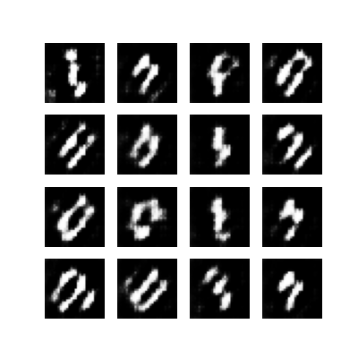
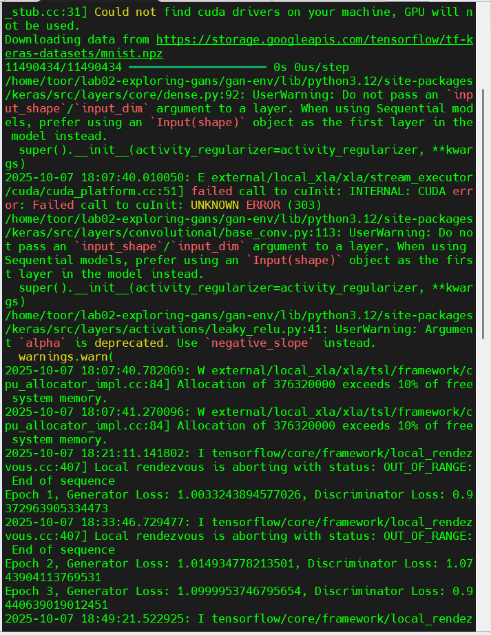

# Lab 02: Exploring Generative Adversarial Networks (GANs) with TensorFlow

## Objective
Gain a theoretical understanding of Generative Adversarial Networks (GANs) and implement a basic GAN using TensorFlow on the MNIST dataset.

## Environment Used
- **Platform:** AWS EC2 t3.medium (2 vCPUs, 4 GB RAM, CPU-only)
- **OS:** Ubuntu 24.04 LTS
- **Python:** 3.12
- **TensorFlow:** 2.20.0
- **Run Time:** ≈ 55 minutes for 5 epochs

## Key Results
Below are real outputs from the training:
- **Generated Output:**
  
- **Training Log:**
  

## Steps Overview
1. Environment setup and TensorFlow installation  
2. Understanding GAN components (Generator + Discriminator)  
3. Implementing the GAN architecture in TensorFlow  
4. Training the model on MNIST  
5. Generating and visualizing new images

## Final Observations
- CPU-based training was successful on AWS EC2 t3.medium.  
- Generator loss stabilized around 0.9–1.1 and discriminator loss ≈ 1.0, showing healthy adversarial training.  
- Generated digits (though blurry) resembled MNIST after 5 epochs.
