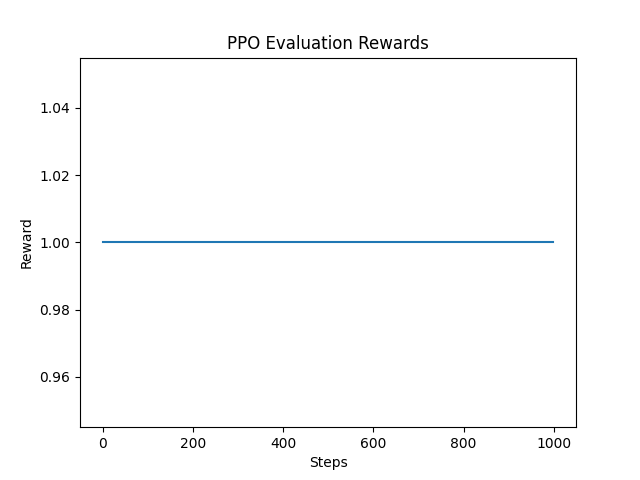
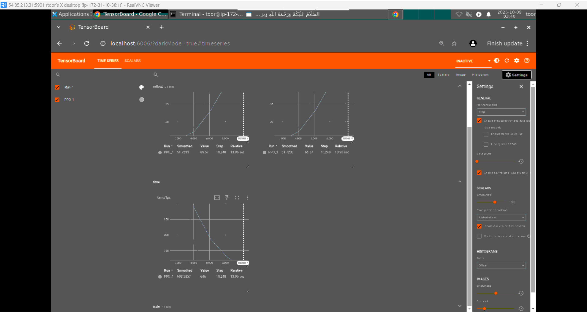

# Lab 07 – Reinforcement Learning with **Gymnasium** (PPO & DQN)

## 🎯 Objective
Hands-on reinforcement learning using **Gymnasium** (`CartPole-v1`) and **Stable-Baselines3**. You will train PPO and DQN agents, visualize results (Matplotlib + TensorBoard), implement a custom reward, and verify save/load.

## ✅ Results (Your Real Outputs)
### 📈 PPO Evaluation Rewards


### TensorBoard Metrics Overview


## 🧱 Prerequisites (No update/upgrade)
- Ubuntu VM with Python 3.8+
- No `apt update/upgrade` required
- Install using `--break-system-packages`

## 🚀 Quickstart
```bash
python3 -m venv rl_env
source rl_env/bin/activate
pip install gymnasium[classic_control] stable-baselines3 matplotlib numpy tensorboard --break-system-packages
sudo apt install xvfb -y  # headless rendering support
```

## 🧩 Steps
1. **Test environment** → `python3 code/test_gymnasium.py`
2. **Train PPO** → `python3 code/train_ppo.py | tee screenshots/ppo_training_output.txt`
3. **Evaluate PPO (saves plot)** → `xvfb-run -s "-screen 0 640x480x24" python3 code/evaluate_agent.py`
4. **TensorBoard training** → `python3 code/train_tensorboard.py && tensorboard --logdir ./logs`
5. **Train DQN** → `python3 code/train_dqn.py | tee screenshots/dqn_training_output.txt`
6. **Custom reward check** → `python3 code/custom_env.py`
7. **Save/Load verify** → `python3 code/save_load_test.py`

## 📦 Structure
```
lab07-reinforcement-learning/
├── code/
├── screenshots/
├── README.md
├── commands.sh
├── troubleshooting.md
├── interview_qna.md
└── layman_explanation.md
```

## 🧪 Notes
- All scripts use **Gymnasium** imports.
- Training scripts suppress Gym warnings to keep logs clean.
- Visualizations are saved to `screenshots/` for headless VMs.

---
**Author:** Generated for your Advanced Topics in ML labs.  **Date:** 2025-10-09
